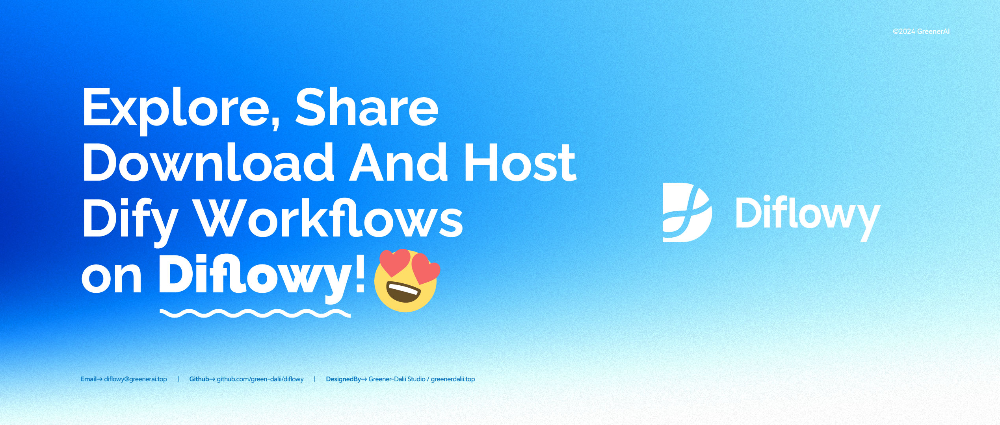

# Diflowy

> Explore, Share, Download, Host Dify Workflows in Diflowy.

### [🌐 Visit Now → Diflowy](https://diflowy.greenerai.top/)

English | [简体中文](README_CN.md) | [日本語](README_JP.md)

## 🚀 About

Diflowy is a vibrant community platform for Dify workflows where you can:

- 🔗 Connect with global Dify enthusiasts
- 🎨 Share your creative workflows
- 🔍 Find workflows to scale your projects
- 💾 Hosting your workflows and Collaborate with partners

## 🌟 Features

- 🔒 **Private-Hosted Mode**: Ensures data security and integrity with database-level AES-GCM encryption, ideal for enterprise and personal privacy needs.
- 📂 **Version Management**: Effortlessly manage multiple versions of Workflow files, simplifying version control.
- 👥 **Collaborative Working**: Collaborate efficiently with partners in the Workspace and synchronise the progress of Dify Workflows.
- 📊 **Real-time Preview**: Instantly visualize Workflow structures through node diagrams for clear insights.
- 📦 **Quick Import**: Easily import via URL to Dify.AI with a seamless one-click process.
- 👥 **User-driven**: A collaborative Workflow knowledge base that benefits everyone.
- 🔔 **Dynamic Updates**: Keep up-to-date with the latest advancements in Dify Workflow.

## 🌍 Community

Join our innovative community! Whether you're a seasoned developer or a beginner, there's a place for you in Diflowy.

## 🤝 Contributing

Your contributions make Diflowy thrive. Check out `CONTRIBUTING.md` for our code of conduct and pull request process. We welcome your ideas and suggestions in our [Github Discussions](https://github.com/green-dalii/diflowy/discussions).

## 📄 License

This project is under the MIT License - see `LICENSE.md` for details.

## 💖 Acknowledgments

Diflowy wouldn't be possible without the support of:

- [Dify](https://github.com/langgenius/dify): The Innovation Engine for GenAI Applications.
- [Astro](https://astro.build/): The web framework for content-driven websites
- [TailwindCSS](https://tailwindcss.com/): Rapidly build modern websites without ever leaving your HTML.
- [ReactFlow](https://reactflow.dev/): Wire Your Ideas with React Flow
- [Color4bg.JS](https://github.com/winterx/color4bg.js): Super easily generate dynamic, abstract, and visually stunning background images for your web pages based on WebGL and JavaScript.
- [Cloudflare](https://www.cloudflare.com): Powered by Cloudflare Pages and Cloudflare D1 Database
- This Website is inspired by project: [vasquez-esteban/Kreativ-Software](https://github.com/vasquez-esteban/kreativ-software)
- [Awesome-Dify-Workflow](https://github.com/svcvit/Awesome-Dify-Workflow): Sharing some Dify workflows.
- [Dify101](https://dify101.com/): Dify tutorial: Unlock the power of Dify.ai.

## 🎉 Let's Create!

We hope you enjoy being part of Diflowy as much as we do. Let's build something amazing together!

## 🗺️ Roadmap

- [x] Launch Diflowy
- [x] Version Management Support
- [x] Private-Hosted Mode for workflows
- [x] i18n Support
- [x] Login with Google OAuth and Email
- [x] Apply Dify Official Workflow Style
- [x] Database-level encryption for Private-Hosted files
- [x] Add workspace collaboration support for advanced users
- [ ] AI Summarization for Workflows
- [ ] Search and Filter Workflows
