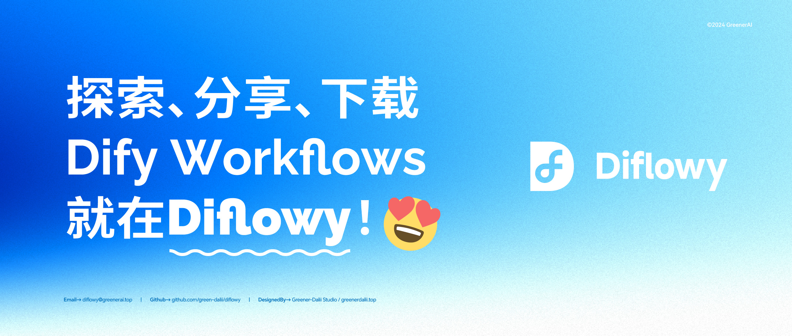

# Diflowy

> Dify Workflows的分享、发现、下载和托管平台

### [🌐 立刻访问 → Diflowy](https://diflowy.greenerai.top/)

[English](README.md) | 简体中文 | [日本語](README_JP.md)

## 🚀 简介

Diflowy是一个充满活力的社区平台,致力于Dify工作流的分享与发现。在这里,你可以:

- 🔗 连接全球Dify爱好者
- 🎨 分享你的创意作品  
- 🔍 发现适合你项目的工作流

## 🌟 特性

- 📊 **实时预览**: 通过节点图快速可视化 Workflow 结构，一目了然
- 📂 **版本管理**: 便捷上传和下载多版本 Workflow 文件，不用在为多版本文件管理而烦恼
- 📦 **快捷导入**: 支持通过URL一键导入至 Dify.AI，体验丝滑
- 🔒 **支持私有托管模式**: 可化身为您的个人 Workflow 文件管理器，保持您的 Dify 列表干净整洁
- 👥 **用户驱动**: 由你我共同贡献和受益的 Workflow 知识库
- 🔔 **动态更新**: 及时了解 Dify Workflow 的最新趋势

## 🌍 社区

加入我们充满创新的社区吧! 无论你是经验丰富的开发者还是新手,Diflowy都有你的一席之地。

## 🤝 贡献

你的贡献是Diflowy蓬勃发展的动力。请查阅`CONTRIBUTING.md`了解行为准则和提交Pull Request的流程。也可以在[Discussions](https://github.com/green-dalii/diflowy/discussions)中提出你的想法。

## 📄 许可证

本项目采用MIT许可证 - 详情请见`LICENSE.md`文件。

## 💖 致谢

Diflowy的诞生离不开以下项目的支持:

- [Dify](https://github.com/langgenius/dify): The Innovation Engine for GenAI Applications.
- [Astro](https://astro.build/): The web framework for content-driven websites
- [TailwindCSS](https://tailwindcss.com/): Rapidly build modern websites without ever leaving your HTML.
- [ReactFlow](https://reactflow.dev/): Wire Your Ideas with React Flow
- [Color4bg.JS](https://github.com/winterx/color4bg.js): Super easily generate dynamic, abstract, and visually stunning background images for your web pages based on WebGL and JavaScript.
- [Cloudflare](https://www.cloudflare.com): Powered by Cloudflare Pages and Cloudflare D1 Database
- This Website is inspired by project: [vasquez-esteban/Kreativ-Software](https://github.com/vasquez-esteban/kreativ-software)
- [Awesome-Dify-Workflow](https://github.com/svcvit/Awesome-Dify-Workflow): Sharing some Dify workflows.
- [Dify101](https://dify101.com/): Dify tutorial: Unlock the power of Dify.ai.

## 🎉 开始探索吧!

我们期待你能在Diflowy社区中找到乐趣。让我们一起创造精彩!

 ## 🗺️ 路线图
 
- [x] Diflowy社区上线
- [x] 版本管理支持
- [x] 用于工作流的隐私托管模式
- [x] 国际化多语言支持
- [x] 使用谷歌账户和邮箱登录
- [x] 应用 Dify 官方工作流样式
- [ ] 隐私托管文件实现数据库层面加密
- [ ] 对上传工作流进行 AI 自动摘要描述
- [ ] 搜索和筛选工作流
