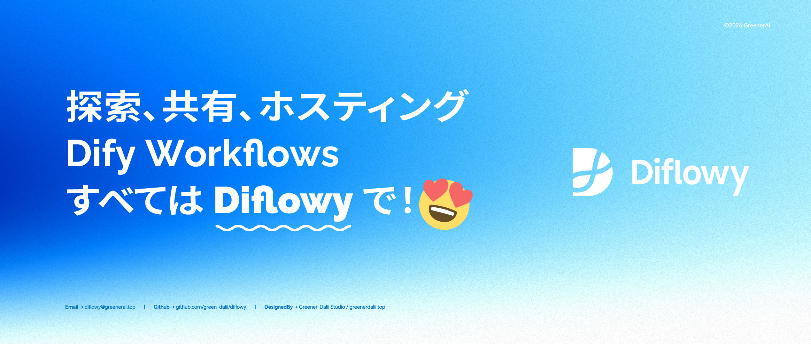

# Diflowy

> Difyワークフローの共有・発見・ダウンロードプラットフォーム

### [🌐 今すぐアクセス → Diflowy](https://diflowy.greenerai.top/)

[English](README.md) | [简体中文](README_CN.md) | 日本語

## 🚀 概要

Diflowyは、Difyワークフローのための活気あるコミュニティプラットフォームです。ここでは：

- 🔗 世界中のDify愛好者とつながる
- 🎨 あなたの創造的なワークフローを共有する
- 🔍 プロジェクトに適したワークフローを見つける

ことができます。

## 🌟 特徴

- 🔒 **プライベートホスティングモード**: データベースレベルのAES-GCM暗号化ストレージを採用し、データの安全性と完全性を確保します。そして、企業や個人のプライバシーホスティングアプリケーションシナリオに適用可能です。
- 📂 **バージョン管理**: 複数バージョンのWorkflowファイルを簡単に管理できます。
- 📊 **リアルタイムプレビュー**: ノードグラフを通じてWorkflowの構造を迅速に可視化し、一目でわかります。
- 📦 **クイックインポート**: URLを介してDify.AIに迅速にインポートできます。
- 👥 **ユーザー主導**: あなたと私が共同で貢献し、利益を得るWorkflowの知識ベース。
- 🔔 **ダイナミックアップデート**: Dify Workflowの最新動向をリアルタイムで追えます。

## 🌍 コミュニティ

革新的なコミュニティに参加しませんか？経験豊富な開発者も初心者も、Diflowyには皆様の居場所があります。

## 🤝 貢献

皆様の貢献がDiflowyを発展させます。行動規範とプルリクエストのプロセスについては`CONTRIBUTING.md`をご覧ください。

## 📄 ライセンス

本プロジェクトはMITライセンスの下で公開されています。詳細は`LICENSE.md`をご参照ください。

## 💖 謝辞

Diflowyは以下のプロジェクトのサポートなしでは実現できませんでした：

- [Dify](https://github.com/langgenius/dify): GenAIアプリケーションのイノベーションエンジン
- [Astro](https://astro.build/): コンテンツ駆動型ウェブサイトのためのウェブフレームワーク
- [TailwindCSS](https://tailwindcss.com/): HTMLを離れることなく、現代的なウェブサイトを高速に構築
- [ReactFlow](https://reactflow.dev/): React Flowであなたのアイデアを形にする
- [Color4bg.JS](https://github.com/winterx/color4bg.js): WebGL と JavaScript を使用して、動的で抽象的で、視覚的に印象的な背景画像を簡単に生成します
- [Cloudflare](https://www.cloudflare.com): Cloudflare PagesとCloudflare D1データベースを活用
- 本ウェブサイトは以下のプロジェクトにインスピレーションを受けています: [vasquez-esteban/Kreativ-Software](https://github.com/vasquez-esteban/kreativ-software)
- [Awesome-Dify-Workflow](https://github.com/svcvit/Awesome-Dify-Workflow): いくつかのDifyのワークフローを共有します
- [Dify101](https://dify101.com/): Difyチュートリアル: Dify.aiの力を最大限に引き出します

## 🎉 さあ、始めましょう！

Diflowyコミュニティの一員となり、共に素晴らしいものを作り上げていきましょう！

## 🗺️ ロードマップ

- [x] Diflowyコミュニティの立ち上げ
- [x] バージョン管理のサポート (複数バージョンのワークフローを管理できます)
- [x] ワークフロー用のプライバシーマネージドモード
- [x] 国際化のサポート (複数言語に対応します)
- [x] Google アカウントとメールアドレスでログイン
- [x] Dify の公式ワークフロースタイルを適用し、一貫性を保ちます
- [x] プライベートなホストファイルのデータベースレベルの暗号化
- [ ] 上級ユーザー向けにワークスペース・コラボレーションのサポートを追加
- [ ] AI がアップロードされたワークフローを自動的に要約し、その内容を説明します
- [ ] ワークフローを簡単に検索し、必要なものだけを絞り込むことができます
