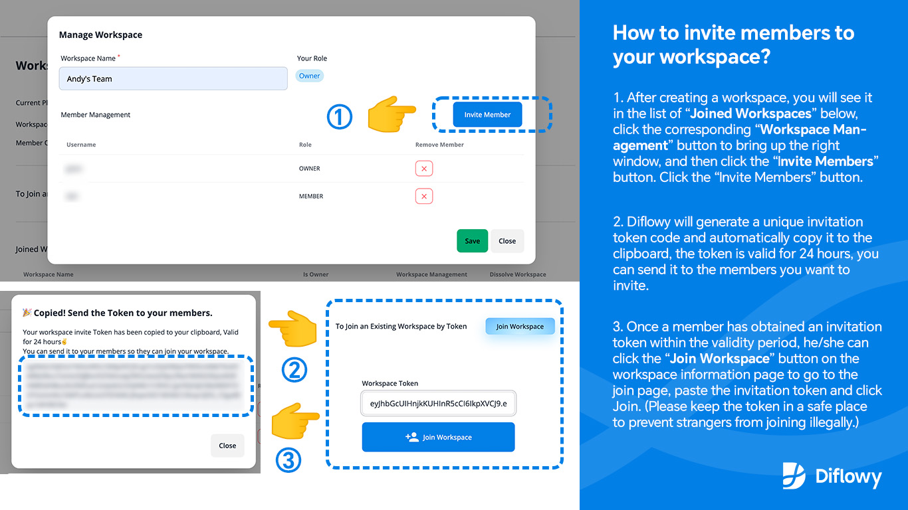

To better meet the advanced needs of team and enterprise users, we are thrilled to announce that Diflowy now supports **Multi-User Collaboration in Workspaces**. This means you can share and collaborate on multiple versions of workflows within your workspace, facilitating efficient communication of Dify Workflow files with your team members.

Currently, the Workspace collaboration feature is an advanced capability in beta testing. We welcome you to apply for beta access(See end of article for ways to participate). In the future, Diflowy will introduce paid services for advanced features based on optimizing the current experience. We look forward to your feedback and suggestions.

You can create your own workspace by following these steps (click [here](/user/workspace) to go to your workspace page):

You can invite members to your workspace by following the steps below:

You can upload and share Dify Workflow files with members by following these steps:

To encourage community building, we are offering **200 beta slots**. Users who receive beta access will enjoy a free one-year subscription to the Team Plan. Further contributions to the community can extend the plan duration or upgrade to the Enterprise Plan. Diflowy currently offers three account types: **Free Plan** (available upon registration), **Team Plan**, and **Enterprise Plan**. Here are the details:

- ### **Free Plan**
  - [x] Available upon registration
  - [x] Unlimited downloads and uploads of Workflows
  - [x] Host an unlimited number of public and private Workflows
  - [x] Workflow version control
  - [x] Instant preview of Workflow node structure
  - [x] One-click import of Workflows to Dify.AI
  - [x] Github Discussions community support 
  - [ ] No collaboration workspaces

- ### **Team Plan**
  - [x] Includes all Free Plan features
  - [x] Create **1 collaboration workspace** with up to **10 members**
  - [x] Diflowy official email support

- ### **Enterprise Plan**
  - [x] Includes all Team Plan features
  - [x] Create up to **10 collaboration workspaces** with up to **100 members**
  - [x] Diflowy official instant messaging (IM) support

The Free Plan of Diflowy includes all the basic features needed for individuals, allowing you to enjoy the convenience of Workflow version management, sharing, and hosting. When you need to collaborate with multiple users, we recommend applying for the Team Plan or Enterprise Plan beta to meet your needs.

How to apply for internal testing: Send your registered account email (when logging in with Google or Mailbox) or registered username (when logging in with Github) and actual requirements to the following ways, to
- By email: *diflowy@greenerai.top*
- By commenting on Github Discussion: [Click here to comment](https://github.com/green-dalii/diflowy/discussions/10)

If you wish to expedite your beta access or extend your premium plan experience, we encourage you to share more high-quality Dify Workflows or use the hashtag *#Diflowy* on various social media platforms (Twitter, Facebook, Instagram, Telegram, Discord, etc.) to share your Diflowy user experience. We will accelerate your beta review process.