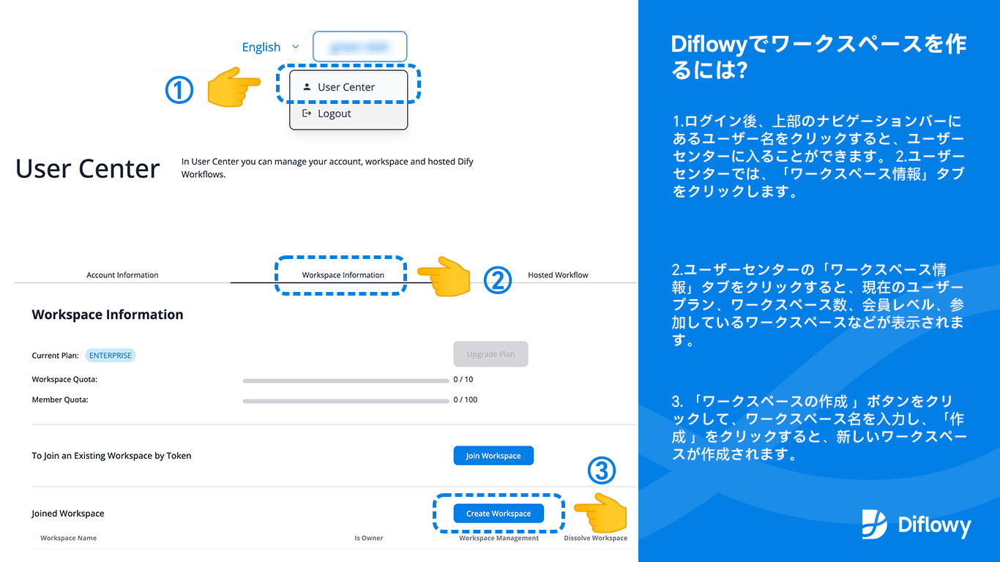
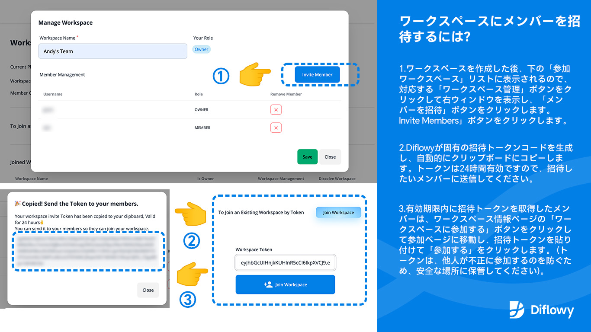
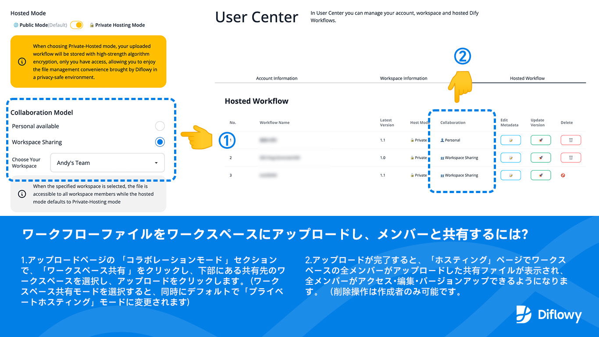

チームや企業ユーザーの高度なニーズに応えるため、Diflowyが**ワークスペース（Workspace）でのマルチユーザーコラボレーション**をサポートすることを嬉しく思います。これにより、ワークスペース内で複数バージョンのワークフローを共有し、管理することができ、チームメンバーとのDify Workflowファイルの効率的なコミュニケーションが可能になります。

現在、ワークスペースコラボレーション機能は高度な機能であり、ベータテスト段階にあります。メールでのベータアクセス申請を歓迎します（参加方法は記事の最後を参照）。将来的には、現在の体験を最適化した上で、高度な機能に対する有料サービスを導入する予定です。フィードバックや提案をお待ちしています。

以下の手順で自分のワークスペースを作成できます（[こちら](/user/workspace)をクリックするとワークスペースのページにジャンプします）：

以下の手順で、自分のワークスペースにメンバーを招待することができます：

以下の手順で、Dify Workflow ファイルをアップロードし、メンバーと共有することができます：

コミュニティの構築を促進するため、**200のベータスロット**を提供します。ベータアクセスを獲得したユーザーは、チームプラン（Team Plan）の1年間の無料利用権を得られます。コミュニティへのさらなる貢献により、プラン期間を延長したり、エンタープライズプラン（Enterprise Plan）にアップグレードすることも可能です。現在、Diflowyは3つのアカウントタイプを提供しています：**無料プラン**（Free Plan、登録時に即時利用可能）、**チームプラン**（Team Plan）、**エンタープライズプラン**（Enterprise Plan）。詳細は以下の通りです：

- ### **無料プラン（Free Plan）**
  - [x] 登録時に即時利用可能
  - [x] ワークフローの無制限ダウンロードとアップロード
  - [x] 公開および個人プライバシーワークフローの無制限ホスティング
  - [x] ワークフローバージョン管理機能
  - [x] ワークフローノード構造の即時プレビュー
  - [x] ワークフローをDify.AIへのワンクリックインポート
  - [x] Github Discussionsコミュニティサポート 
  - [ ] コラボレーションワークスペースはサポートされていません

- ### **チームプラン（Team Plan）**
  - [x] 無料プランのすべての機能を含む
  - [x] **1つ**のコラボレーションワークスペースを作成し、最大**10名**のメンバーを含む
  - [x] Diflowy公式メールサポート

- ### **エンタープライズプラン（Enterprise Plan）**
  - [x] チームプランのすべての機能を含む
  - [x] 最大**10つ**のコラボレーションワークスペースを作成し、最大**100名**のメンバーを含む
  - [x] Diflowy公式インスタントメッセージング（IM）サポート

Diflowyの無料プランには、個人が必要とするすべての基本機能が含まれており、ワークフローバージョン管理、共有、ホスティングの利便性を享受できます。複数のユーザーとコラボレーションする必要がある場合は、チームプランまたはエンタープライズプランのベータアクセスを申請することをお勧めします。

内部テストへの応募方法：登録したアカウントのメールアドレス（Googleまたはメールログインを使用した場合）または登録したユーザー名（Githubログインを使用した場合）と実際の要件を以下の方法でお送りください。
- メール： *diflowy@greenerai.top*
- Github Discussionにコメントする：[click here to comment](https://github.com/green-dalii/diflowy/discussions/10)

ベータアクセス申請後、ベータアクセスを迅速に獲得したり、高度なプランの体験期間を延長したい場合は、より多くの高品質なDifyワークフローを共有したり、各種ソーシャルメディアプラットフォーム（Twitter、Facebook、Instagram、Telegram、Discordなど）でハッシュタグ *#Diflowy* を使用してDiflowyのユーザーエクスペリエンスを共有することを歓迎します。ベータレビュープロセスを加速します。