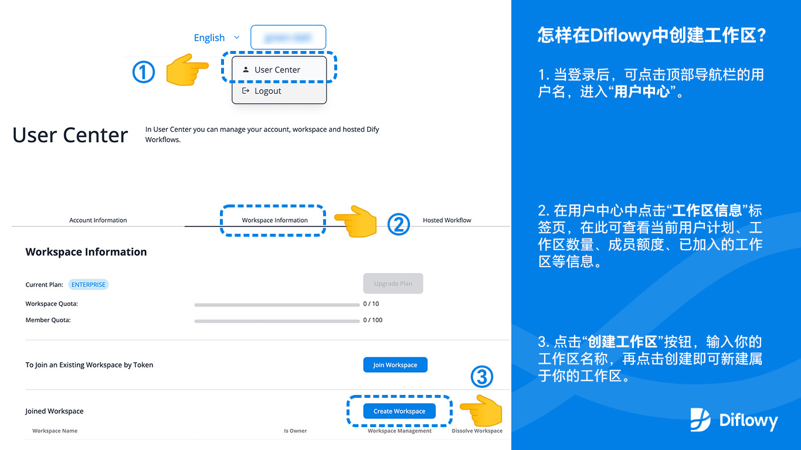
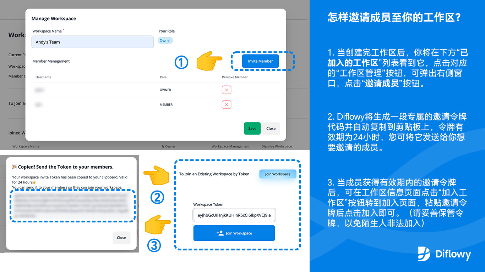
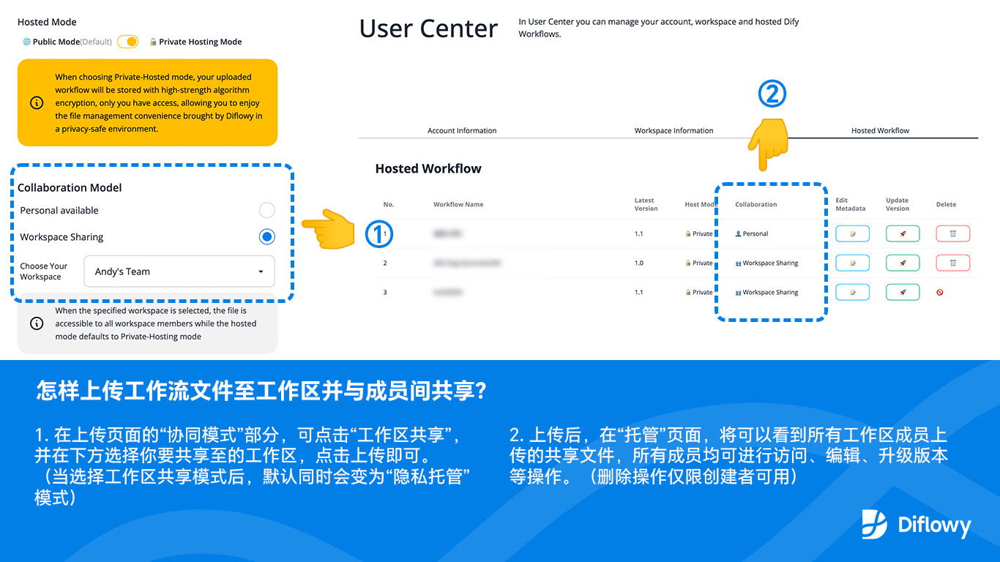

为更好的响应团队与企业用户的高级需求，我们很高兴地宣布Diflowy目前已支持**工作区（Workspace）多人协同**工作能力，这意味着您可以在工作区内与您的成员共享和协作管理多版本工作流，方便您与团队成员高效的进行Dify Workflow文件交流。

目前工作区协同功能属于高级特性，正处于内测阶段，我们欢迎您申请内测（内测参与方式见文末），后期Diflowy也会在做好当前体验的基础上，针对高级特性适时推出付费服务，我们期待您的反馈和建议。

登录Diflowy并通过内测后，通过以下步骤，您可以创建属于你的工作区（点击[此处](/user/workspace)可跳转到您的工作区页面）：

通过以下步骤，您可以邀请成员至您的工作区：

通过以下步骤，您可以上传及与成员间共享Dify Workflow文件：

为鼓励大家共建Diflowy社区，我们将推出**200名内测名额**，获得内测资格的用户，将免费获得团队计划（Team Plan）一年的使用时长，当您对社区有进一步的贡献时，还可延长计划时长或升级到企业计划（Enterprise Plan）。目前Diflowy初定三种账户类型：**免费计划**（Free Plan，注册时即获得）、**团队计划**（Team Plan）、**企业计划**（Enterprise Plan）。其中：

- ### **免费计划（Free Plan）**
  - [x] 注册时即获得
  - [x] Workflow无限下载和上传次数
  - [x] 可托管不限数量的公开及个人隐私Workflow
  - [x] Workflow版本控制能力
  - [x] 即时预览Workflow节点结构图
  - [x] 一键导入Workflow至Dify.AI
  - [x] Github Discussions社区支持 
  - [ ] 不支持协同工作区

- ### **团队计划（Team Plan）**
  - [x] **包含免费计划所有功能**
  - [x] 可建立 **1个协同工作区**，包含 **最多10名成员**
  - [x] Diflowy官方邮件响应支持

- ### **企业计划（Enterprise Plan）**
  - [x] **包含团队计划所有功能**
  - [x] 可建立 **最多10个协同工作区**，包含 **最多100名成员**
  - [x] Diflowy官方即时通信（IM）响应支持

Diflowy免费计划包含个人所需的所有基础功能，您可以享受Diflowy带来便利的Workflow版本管理、分享与托管能力。当您需要与多人协同时，我们推荐您申请团队计划或企业计划内测，以满足您的需求。

内测申请方法：发送您的注册账户邮箱（当使用Google或邮箱登录时）或注册用户名（当使用Github登录时）和实际需求，至以下途径，
- 通过邮件：*diflowy@greenerai.top*
- 通过在Github Discussion上评论：[点击这里评论](https://github.com/green-dalii/diflowy/discussions/10)

如果您在申请内测后，想更快获得内测资格或更长的高级计划体验时长，欢迎您上传分享更多优质 Dify Workflow 或在各大社交媒体平台（微信、微博、知乎、Twitter、Facebook、Instagram、Telegram、Discord等）使用标签 *#Diflowy* 与朋友们分享您使用 Diflowy 的用户体验，我们将为您加速内测审核流程。