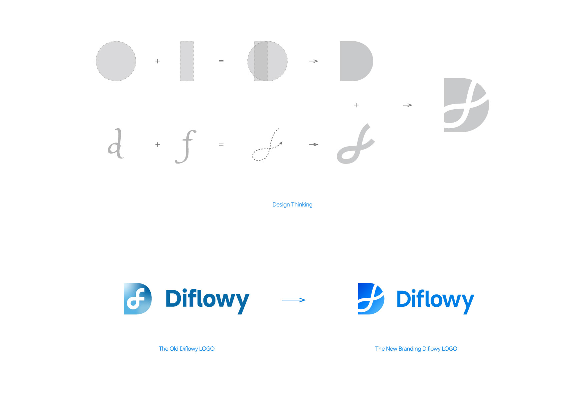

I'm delighted to engage with everyone for the first time on the official Diflowy blog. Allow me to introduce the Diflowy community once again:

Diflowy is a vibrant, open, and inclusive user-driven community dedicated to the exploration, sharing, hosting, and downloading of Dify.AI workflows. Our community boasts several key features:
- **Private Hosting**: We employ database-level AES-GCM encryption storage technology to ensure the security and integrity of your data, making it suitable for both enterprise and personal privacy hosting needs.
- **Version Management**: We provide a convenient multi-version workflow file management system, so you no longer have to worry about version control.
- **Real-time Preview**: With the node graph, you can quickly and intuitively understand the structure of your workflow at a glance.
- **Quick Import**: You can easily import workflows to Dify.AI via URL, ensuring a smooth and user-friendly experience.

To ensure the security of our community, all of Diflowy's infrastructure code has been open-sourced on [GitHub](https://github.com/green-dalii/diflowy). We welcome everyone to come and give us a star⭐️.

Additionally, we are proud to introduce our new brand identity, designed by [Greener-Dalii Studio](https://greenerdalii.top). This redesign not only reflects our vision of becoming a more professional and trustworthy platform but also symbolizes our firm commitment to the future.

During the initial trial phase, Diflowy has attracted over 200 registered users from around the world. Some enterprise users have expressed a desire for a **Workspace Feature**, similar to the one in Dify, to facilitate collaboration among team members. In response to this advanced user need, we are working diligently on the development and testing of this feature and plan to launch it soon. Stay tuned!

During the development process, we warmly welcome customers who need the workspace feature to apply for beta testing. If you would like to apply for beta testing or have any other feature suggestions, please send an email to diflowy@greenerai.top or join the discussion on our [GitHub Discussions](https://github.com/green-dalii/diflowy/discussions) page.
