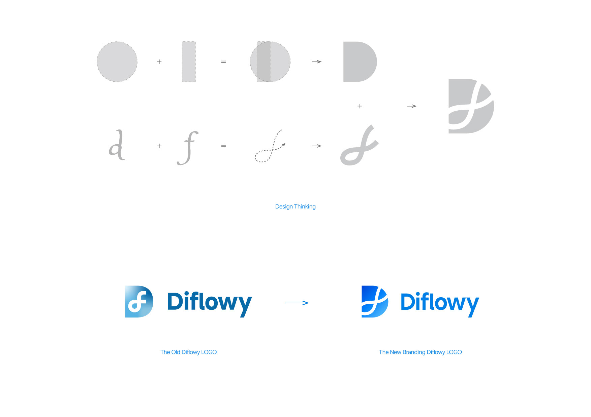
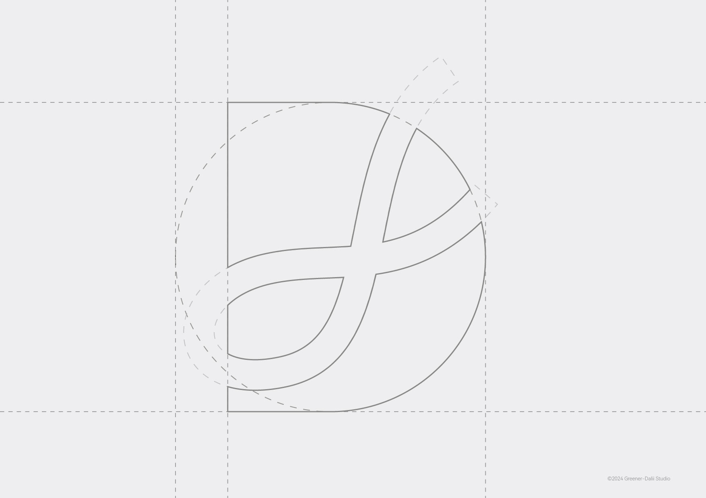
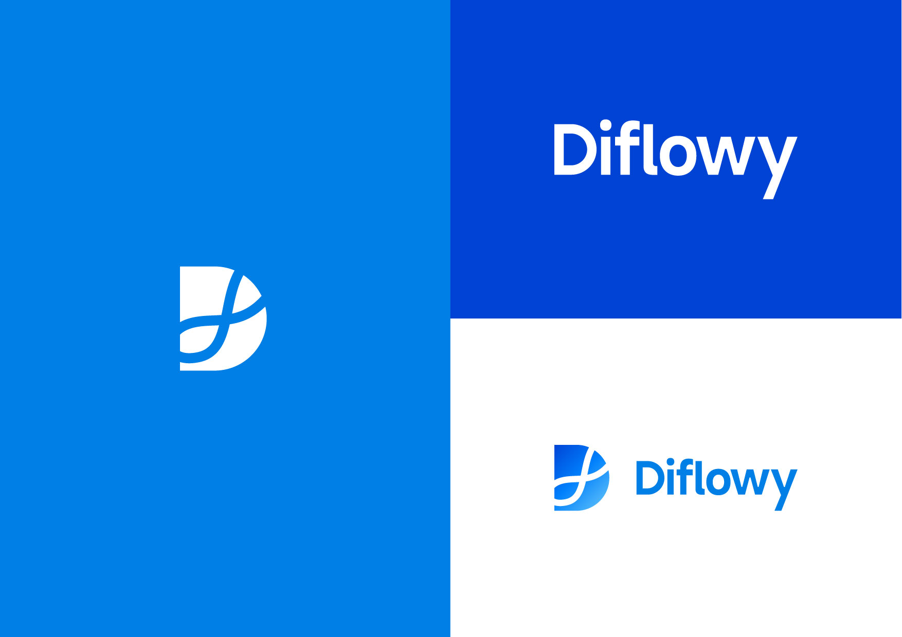
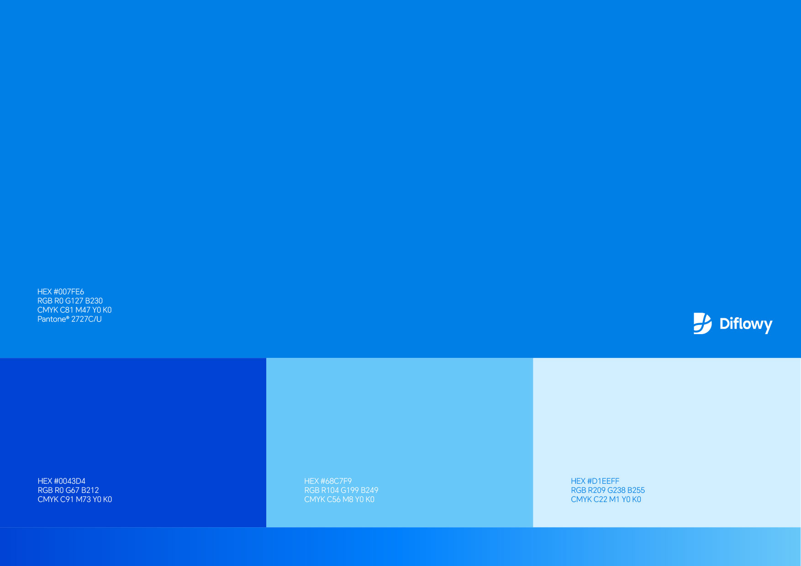
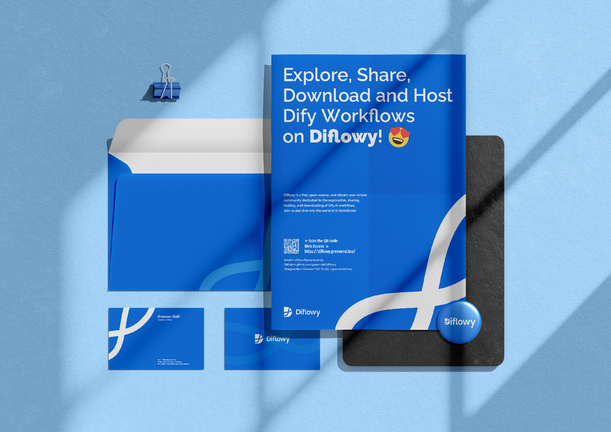

Diflowyの公式ブログで皆さんと初めて交流できることを大変うれしく思います。ここでは、Diflowyコミュニティについて再度ご紹介させていただきます：

Diflowyは、活気があり、オープンで受け入れ態勢の整ったユーザー主導型コミュニティです。私たちは、Dify.AIのワークフローの探求、共有、ホスティング、ダウンロードサービスに焦点を当てています。現在、私たちのコミュニティには以下の特徴があります：

- **プライベートホスティング**：データベースレベルのAES-GCM暗号化ストレージ技術を採用しており、データの安全性と完全性を確保しています。企業や個人のプライバシー保護に適しています。
- **バージョン管理**：複数バージョンのWorkflowファイルを簡単に管理できる機能を提供しています。バージョン管理に頭を悩ませることなく、快適にご利用いただけます。
- **リアルタイムプレビュー**：ノード図を活用することで、Workflowの構造を迅速かつ直感的に把握できます。一目で全体像がわかります。
- **クイックインポート**：URLをワンクリックでDify.AIにインポートできる機能をサポートしており、操作が簡単で、スムーズな体験を提供しています。

コミュニティの安全性を確保するために、Diflowyのすべてのインフラストラクチャコードは[Github](https://github.com/green-dalii/diflowy)でオープンソース化されています。ぜひStar⭐️をお願いします。

また、私たちは[Greener-Dalii Studio](https://greenerdalii.top)が手がけた新しいブランドアイデンティティを誇りに思います。これにより、Diflowyがよりプロフェッショナルで、ユーザーに信頼される方向へと発展するビジョンが明確になりました。また、私たちの未来への強いコミットメントも象徴しています。

試験運用段階では、Diflowyには世界中から200人以上の登録ユーザーが集まりました。その中でも、一部の企業ユーザーから、メンバー間での共同作業を実現するDifyの**ようなワークスペース**（Workspace）機能の追加を希望する声がありました。この高級ユーザーのニーズに対応するため、私たちは開発とテストに全力を尽くしており、近日中にこの機能の提供を開始する予定です。ぜひお楽しみに。

開発プロセスにおいて、ワークスペース機能が必要なお客様のベータテスト参加を熱烈に歓迎しています。ベータテストの参加申請やその他の機能提案についてお気軽にお問い合わせください。メールはdiflowy@greenerai.topまで、または[GitHub Discussions](https://github.com/green-dalii/diflowy/discussions)を通じてご連絡ください。