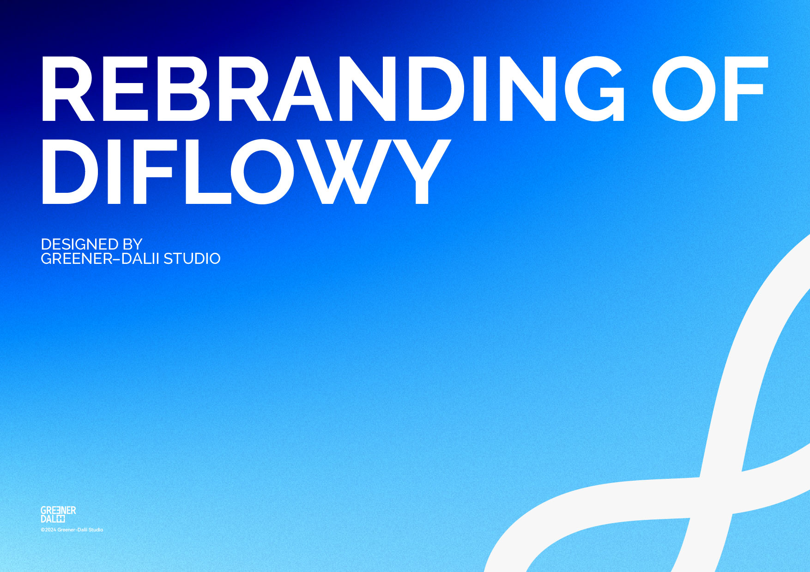
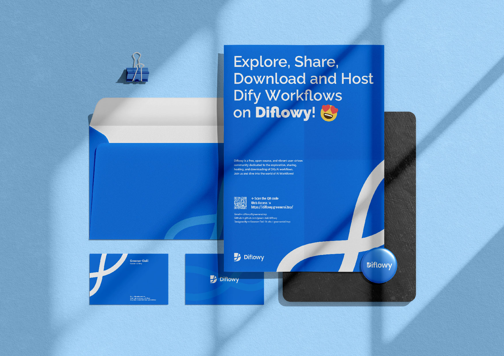

很高兴与大家首次在Diflowy官方博客进行交流。在此，请允许我再次向大家介绍Diflowy社区：

Diflowy是一个充满活力、开放且包容的用户驱动型社区，我们专注于推动Dify.AI工作流的探索、分享、托管与下载服务。目前，我们社区具备以下几大特性：

- **私有托管**：我们采用数据库级AES-GCM加密存储技术，确保数据的安全性与完整性，适用于企业和个人的隐私托管需求。
- **版本管理**：我们提供便捷的多版本Workflow文件管理功能，让您无需为版本管理而烦恼。
- **实时预览**：通过节点图，您可以快速直观地了解Workflow的结构，一目了然。
- **快捷导入**：支持通过URL一键导入至Dify.AI，操作简便，体验流畅。

为了确保社区的安全性，Diflowy的所有基础设施代码均已在[Github](https://github.com/green-dalii/diflowy)上开源，欢迎大家前来Star⭐️。

此外，我们非常高兴地推出了由[Greener-Dalii Studio](https://greenerdalii.top)精心设计的全新品牌形象，这不仅展现了Diflowy向更专业、更值得用户信赖的方向发展的愿景，也象征着我们对未来的坚定承诺。

在前期试运行阶段，Diflowy已吸引了超过200名来自全球的注册用户。其中，一些企业用户表达了希望增加类似Dify中的**工作区**（Workspace）功能，以实现成员间的协同工作。针对这一高级用户的需求，我们正全力以赴进行开发、测试，并计划在近期上线这一功能，敬请期待。

在开发过程中，我们热忱欢迎有工作区需求的客户申请内测使用。如需申请内测资格或提出其他功能建议，请发送邮件至diflowy@greenerai.top，或在[GitHub Discussions](https://github.com/green-dalii/diflowy/discussions)中与我们交流。